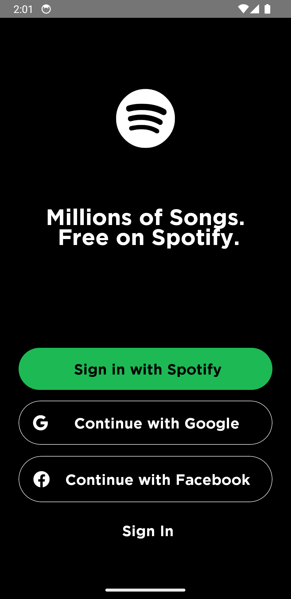
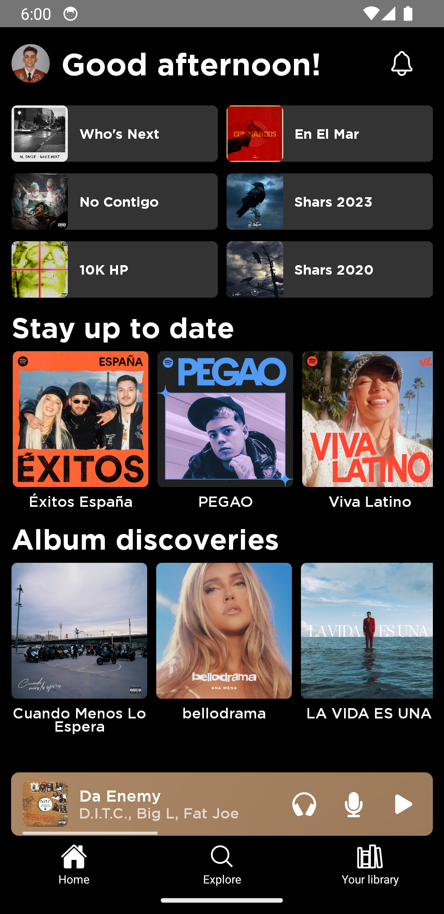
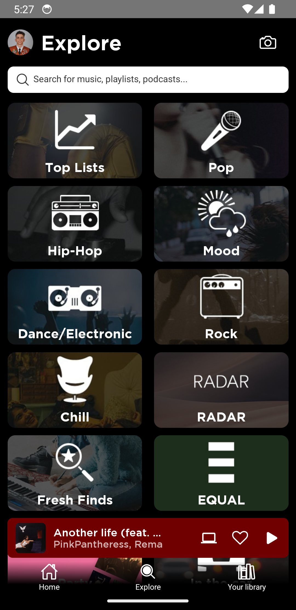
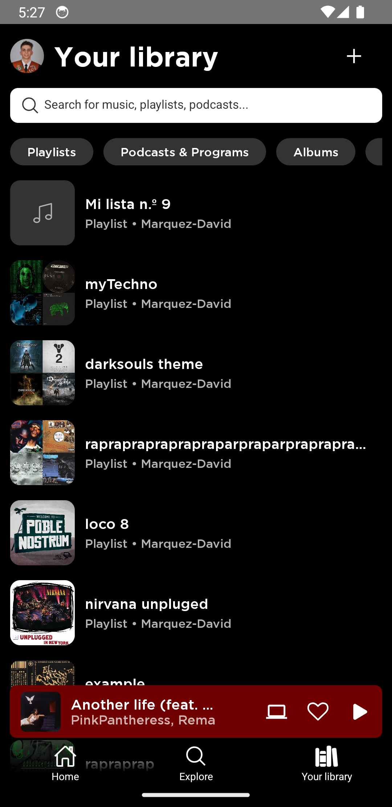
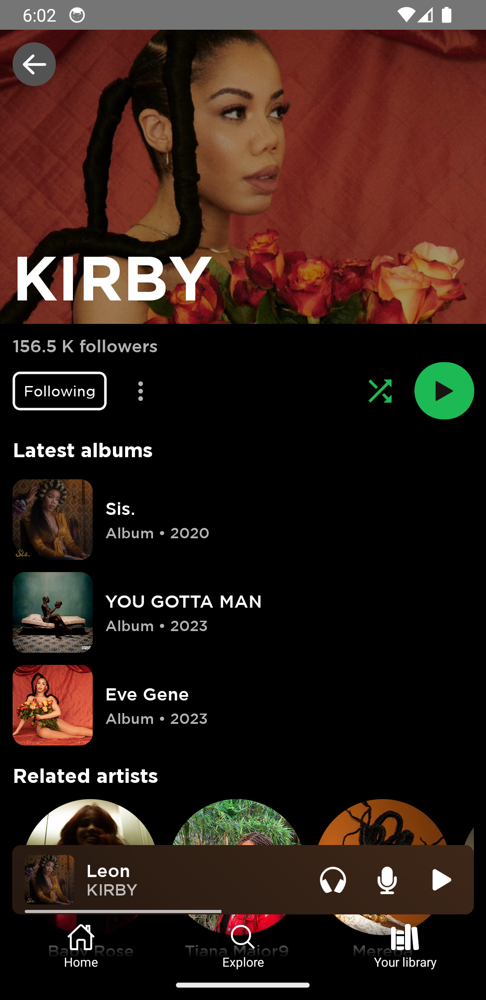
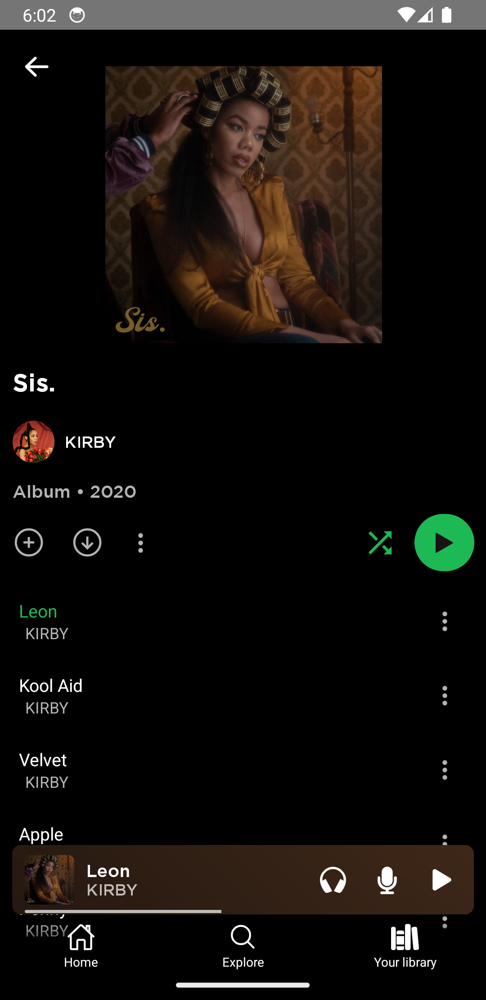
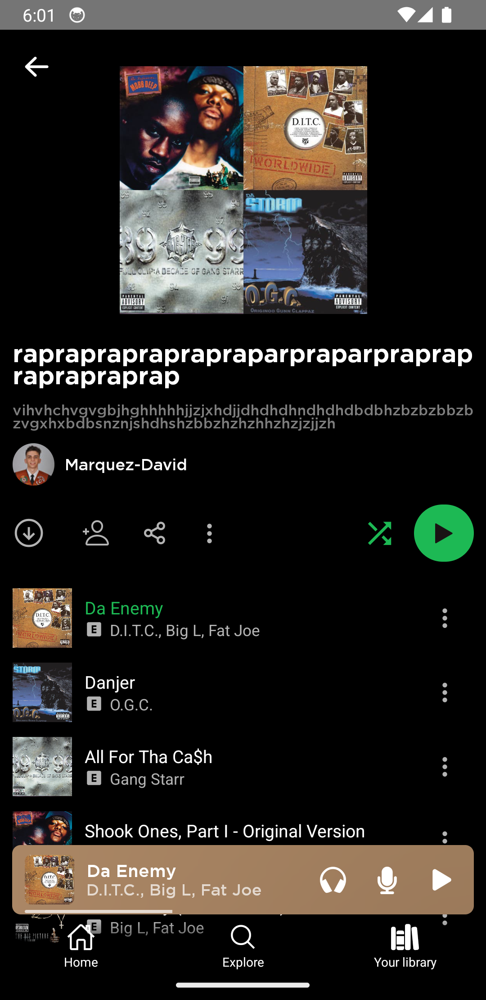
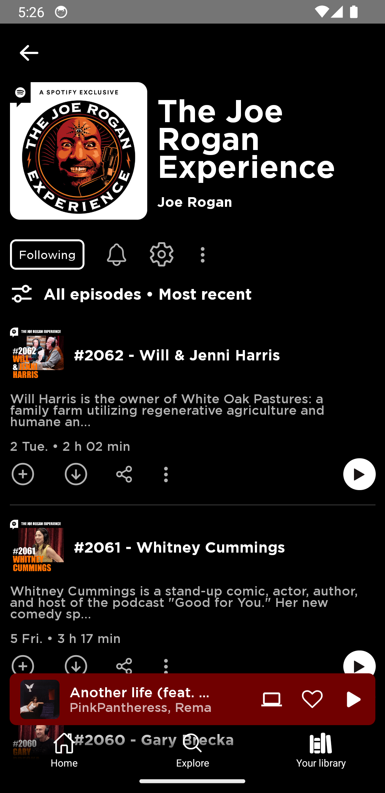

# Spotify Clone App

- [Description](#description)
- [Structure](#structure)
- [Setup](#setup)

## Description
This project is a clone of the popular music streaming application, Spotify. It has been developed using React Native, and the [Spotify API](https://developer.spotify.com/documentation/web-api) for music data. As of now, please note that the project is exclusively supported for Android devices.  

<br>

| LoginScreen | HomeScreen | ExploreScreen | LibraryScreen |
|:---------------:|:---------------:|:---------------:|:---------------:|
|  |  |  | 
| ArtistScreen | AlbumScreen | PlaylistScreen | PodcastScreen |  
 |  |  | 

## Structure

Inside the directory we can find the different functionalities developed for the correct functioning of the project. The structure of the project can be summarized as follows:

1. `Components` #Contains all the source code and style files for the custom components.
2. `Navigation` #This Navigation directory is responsible for handling the navigation logic of the application. It defines the routes, screens, and navigation stacks.
3. `Screens` #This directory consists of all the individual screens or views of the application. Each screen represents a specific user interface (UI) that the user can interact with. 
4. `Services` #Contains code responsible for connecting with Spotify APIs.
5. `Utils` #Contains helper functions that are used across different parts of the application.
6. `Assets` #The Assets directory is used to store static files, such as images, fonts, or other resources required by the project.
7. `Hooks` #This directory contain custom hooks that are used across the application.
8. `Context` #The Context directory holds the context providers and related code for managing the global state of the application, allowing data to be shared and accessed across different components and screens.

## Setup

>**Note**: Make sure you have completed the [React Native - Environment Setup](https://reactnative.dev/docs/environment-setup) till "Creating a new application" step, before proceeding.

## Step 1: Install dependencies

First of all, make sure you are inside the source main directory.
```bash
cd mobile
```

Now, you can install the project dependencies using your favourite package manager:

```bash
# using npm
npm install

# OR using Yarn
yarn install
```

## Step 2: Start the Metro Server

To start Metro, run the following command from the _root_ of your React Native project:

```bash
# using npm
npm start

# OR using Yarn
yarn start
```

## Step 3: Start the Application

Let Metro Bundler run in its _own_ terminal. Open a _new_ terminal from the _root_ of your React Native project. Run the following command to start your _Android_ app:

```bash
# using npm
npm run android

# OR using Yarn
yarn android
```

If everything is set up _correctly_, you should see your new app running in your _Android Emulator_ shortly provided you have set up your emulator/simulator correctly.
